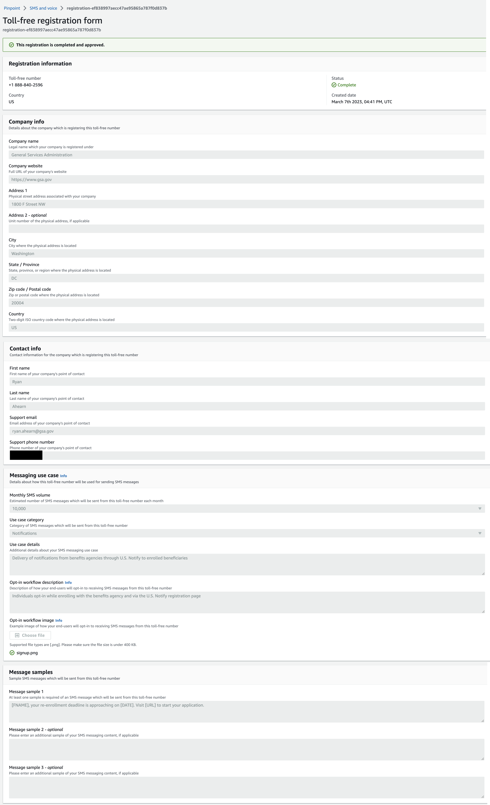

- [Infrastructure overview](#infrastructure-overview)
  - [GitHub Repositories](#github-repositories)
  - [Terraform](#terraform)
  - [AWS](#aws)
  - [New Relic](#new-relic)
  - [Onboarding](#onboarding)
  - [Setting up the infrastructure](#setting-up-the-infrastructure)
- [Using the logs](#using-the-logs)
- [`git` hooks](#git-hooks)
  - [detect-secrets pre-commit plugin](#detect-secrets-pre-commit-plugin)
- [Testing](#testing)
  - [CI testing](#ci-testing)
  - [Manual testing](#manual-testing)
  - [To run a local OWASP scan](#to-run-a-local-owasp-scan)
  - [End-to-end testing](#end-to-end-testing)
- [Deploying](#deploying)
  - [Egress Proxy](#egress-proxy)
  - [Managing environment variables](#managing-environment-variables)
  - [Managing application initialization](#managing-application-initialization)
  - [Sandbox environment](#sandbox-environment)
- [Database management](#database-management)
  - [Initial state](#initial-state)
  - [Data Model Diagram](#data-model-diagram)
  - [Migrations](#migrations)
  - [Purging user data](#purging-user-data)
- [One-off tasks](#one-off-tasks)
- [Test Loading Commands](#commands-for-test-loading-the-local-dev-database)
- [How messages are queued and sent](#how-messages-are-queued-and-sent)
- [Writing public APIs](#writing-public-apis)
  - [Overview](#overview)
  - [Documenting APIs](#documenting-apis)
  - [New APIs](#new-apis)
- [API Usage](#api-usage)
  - [Connecting to the API](#connecting-to-the-api)
  - [Postman Documentation](#postman-documentation)
  - [Using OpenAPI documentation](#using-openapi-documentation)
- [Queues and tasks](#queues-and-tasks)
  - [Priority queue](#priority-queue)
  - [Celery scheduled tasks](#celery-scheduled-tasks)
- [Notify.gov](#notifygov)
  - [System Description](#system-description)
- [Pull Requests](#pull-requests)
  - [Getting Started](#getting-started)
  - [Description](#description)
  - [TODO (optional)](<#todo-(optional)>)
  - [Security Considerations](#security-considerations)
- [Code Reviews](#code-reviews)
  - [For the reviewer](#for-the-reviewer)
  - [For the author](#for-the-author)
- [Run Book](#run-book)
  - [Alerts, Notifications, Monitoring](#-alerts-notifications-monitoring)
  - [Restaging Apps](#-restaging-apps)
  - [Deploying to Production](#-deploying-to-production)
  - [Smoke-testing the App](#-smoke-testing-the-app)
  - [Simulated bulk send testing](#-simulated-bulk-send-testing)
  - [Configuration Management](#-configuration-management)
  - [DNS and Domain Changes](#-dns-and-domain-changes)
  - [Exporting daily scan results for compliance monitoring](#exporting-daily-scan-results-for-compliance-monitoring)
  - [Reviewing daily scan results for compliance](#reviewing-daily-scan-results-for-compliance)
  - [Rotating environment variable secrets](#rotating-environment-variable-secrets)
  - [Known Gotchas](#-known-gotchas)
  - [User Account Management](#-user-account-management)
  - [SMS Phone Number Management](#-sms-phone-number-management)
- [Data Storage Policies \& Procedures](#data-storage-policies--procedures)
  - [Potential PII Locations](#potential-pii-locations)
  - [Data Retention Policy](#data-retention-policy)
- [Troubleshooting](#troubleshooting)
  - [Debug messages not being sent](#debug-messages-not-being-sent)
    - [Getting the file location and tracing what happens](#getting-the-file-location-and-tracing-what-happens)
    - [Viewing the csv file](#viewing-the-csv-file)
  - [Deployment / app push problems](#deployment--app-push-problems)
    - [Routes cannot be mapped to destinations in different spaces](#routes-cannot-be-mapped-to-destinations-in-different-spaces)
    - [API request failed](#api-request-failed)

# Infrastructure overview

A diagram of the system is available [in our compliance repo](https://github.com/GSA/us-notify-compliance/blob/main/diagrams/rendered/apps/application.boundary.png).

Notify is a Flask application running on [cloud.gov](https://cloud.gov), which also brokers access to a PostgreSQL database and Redis store.

In addition to the Flask app, Notify uses Celery to manage the task queue. Celery stores tasks in Redis.

## GitHub Repositories

Application, infrastructure, and compliance work is spread across several repositories:

### Application

- [notifications-api](https://github.com/GSA/notifications-api) for the API app
- [notifications-admin](https://github.com/GSA/notifications-admin) for the Admin UI app
- [notifications-utils](https://github.com/GSA/notifications-utils) for common library functions

### Infrastructure

In addition to terraform directories in the api and admin apps above:

#### We maintain:

- [usnotify-ssb](https://github.com/GSA/usnotify-ssb) A supplemental service broker that provisions SES and SNS for us
- [ttsnotify-brokerpak-sms](https://github.com/GSA/ttsnotify-brokerpak-sms) The brokerpak defining SNS (SMS sending)

#### We use:

- [datagov-brokerpak-smtp](https://github.com/GSA-TTS/datagov-brokerpak-smtp) The brokerpak defining SES
- [cg-egress-proxy](https://github.com/GSA-TTS/cg-egress-proxy/) The caddy proxy that allows external API calls

### Compliance

- [us-notify-compliance](https://github.com/GSA/us-notify-compliance) for OSCAL control documentation and diagrams

## Terraform

We use Terraform to manage our infrastructure, providing consistent setups across the environments.

Our Terraform configurations manage components via cloud.gov. This means that the configurations should work out of the box if you are using a Cloud Foundry platform, but will not work for setups based on raw AWS.

### Development

There are several remote services required for local development:

- S3
- SES
- SNS

Credentials for these services are created by running:

1. `cd terraform/development`
1. `./run.sh`

in both the api repository as well as the admin repository.

This will append credentials to your `.env` file. You will need to manually clean up any prior runs from that file if you run that command again.

You can remove your development infrastructure by running `./run.sh -d`

#### Resetting

`./reset.sh` can be used to import your development infrastructure information in case of a new computer or new working tree and the old terraform state file was not transferred.

#### Offboarding

`./reset.sh -u USER_TO_OFFBOARD` can be used to import another user's development resources in order to clean them up. Steps for use:

1. Move your existing terraform state file aside temporarily, so it is not overwritten.
1. `./reset.sh -u USER_TO_OFFBOARD`
1. Answer no to the prompt about creating missing resources.
1. Run `./run.sh -u USER_TO_OFFBOARD -d` to fully remove the rest of that user's resources.

### Cloud.gov

The cloud.gov environment is configured with Terraform. See [the `terraform` folder](../terraform/) to learn about that.

## AWS

In addition to services provisioned through cloud.gov, we have several services provisioned via [supplemental service brokers](https://github.com/GSA/usnotify-ssb) in AWS. Our AWS services are currently located in [several regions](https://github.com/GSA/usnotify-ssb#aws-accounts-and-regions-in-use) using Studio-controlled AWS accounts.

To send messages, we use Amazon Web Services SNS and SES. In addition, we use AWS Pinpoint to provision and manage phone numbers, short codes, and long codes for sending SMS.

In SNS, we have 3 topics for SMS receipts. These are not currently functional, so senders won't know the status of messages.

Through Pinpoint, the API needs at least one number so that the application itself can send SMS for authentication codes.

The API also has access to AWS S3 buckets for storing CSVs of messages and contact lists. It does not access a third S3 bucket that stores agency logos.

## New Relic

We are using [New Relic](https://one.newrelic.com/nr1-core?account=3389907) for application monitoring and error reporting. When requesting access to New Relic, ask to be added to the Benefits-Studio subaccount.

## Onboarding

- [ ] Join [the GSA GitHub org](https://github.com/GSA/GitHub-Administration#join-the-gsa-organization)
- [ ] Get permissions for the repos via GitHub teams
- [ ] Get access to the cloud.gov org && spaces
- [ ] Set up a user account on [the staging site](https://notify-staging.app.cloud.gov)
- [ ] Get [access to AWS](https://handbook.tts.gsa.gov/launching-software/infrastructure/#cloud-service-provider-csp-sandbox-accounts), if necessary
- [ ] Get [access to New Relic](https://handbook.tts.gsa.gov/tools/new-relic/#how-do-i-get-access-to-new-relic), if necessary
- [ ] Create the local `.env` file by copying `sample.env` and running `./run.sh` within the `terraform/development` folder (see [these docs](https://github.com/GSA/notifications-api/blob/main/docs/all.md#development))
- [ ] Run through [the local setup process](https://github.com/GSA/notifications-api/tree/main#local-setup)
- [ ] Review [the system diagram](https://github.com/GSA/us-notify-compliance/blob/main/diagrams/rendered/apps/application.boundary.png)
- [ ] Do stuff!

Upon completion, an admin should update 🔒[the permissions and access tracker](https://docs.google.com/spreadsheets/d/1Z8s82dbLHHxGC8fF2U1K6YhtZZYVaEdliOZRbKWW9L4/edit#gid=0).

## Setting up the infrastructure

These steps are required for new cloud.gov environments. Local development borrows SES & SNS infrastructure from the `notify-staging` cloud.gov space, so these steps are not required for new developers.

### Steps to do a clean prod deploy to cloud.gov

Steps for deploying production from scratch. These can be updated for a new cloud.gov environment by subbing out `prod` or `production` for your desired environment within the steps.

1. Deploy API app
   1. Update `terraform-production.yml` and `deploy-prod.yml` to point to the correct space and git branch.
   1. Ensure that the `domain` module is commented out in `terraform/production/main.tf`
   1. Run CI/CD pipeline on the `production` branch by opening a PR from `main` to `production`
   1. Create any necessary DNS records (check `notify-api-ses-production` service credentials for instructions) within https://github.com/18f/dns
   1. Follow the `Steps to prepare SES` below
   1. (Optional) if using a public API route, uncomment the `domain` module and re-trigger a deploy
1. Deploy Admin app
   1. Update `terraform-production.yml` and `deploy-prod.yml` to point to the correct space and git branch.
   1. Ensure that the `api_network_route` and `domain` modules are commented out in `terraform/production/main.tf`
   1. Run CI/CD pipeline on the `production` branch by opening a PR from `main` to `production`
   1. Create DNS records for `domain` module within https://github.com/18f/dns
   1. Uncomment the `api_network_route` and `domain` modules and re-trigger a deploy

### Steps to prepare SES

1. After the first deploy of the application with the SSB-brokered SES service completes:
   1. Log into the SES console and navigate to the SNS subscription page.
   1. Select "Request confirmation" for any subscriptions still in "Pending Confirmation" state
1. Find and replace instances in the repo of "testsender", "testreceiver" and "dispostable.com", with your origin and destination email addresses, which you verified in step 1 above.

TODO: create env vars for these origin and destination email addresses for the root service, and create new migrations to update postgres seed fixtures

### Steps to prepare SNS

#### Move SNS out of sandbox.

This should be complete for all regions Notify.gov has been deployed to or is currently planned to be deployed to.

1. Visit the SNS console for the region you will be sending from. Notes:
   1. SNS settings are per-region, so each environment must have its own region
   1. Pinpoint and SNS have confusing regional availability, so ensure both are available before submitting any requests.
1. Choose `Text messaging (SMS)` from the sidebar
1. Click the `Exit SMS Sandbox` button and submit the support request. This request should take at most a day to complete. Be sure to request a higher sending limit at the same time.

#### Request new phone numbers

1. Go to Pinpoint console for the same region you are using SNS in.
1. In the lefthand sidebar, go the `SMS and Voice` (bottom) and choose `Phone Numbers`
1. Under `Number Settings` choose `Request Phone Number`
1. Choose Toll-free number, tick SMS, untick Voice, choose `transactional`, hit next and then `request`
1. Select `Toll-free registrations` and `Create registration`
1. Select the number you just created and then `Register existing toll-free number`
1. Complete and submit the form. Approval usually takes about 2 weeks.
1. See the [run book](./run-book.md) for information on how to set those numbers.

Example answers for toll-free registration form



# Using the logs

If you're using the `cf` CLI, you can run `cf logs notify-api-ENV` and/or `cf logs notify-admin-ENV` to stream logs in real time. Add `--recent` to get the last few logs, though logs often move pretty quickly.

For general log searching, [the cloud.gov Kibana instance](https://logs.fr.cloud.gov/) is powerful, though quite complex to get started. For shortcuts to errors, some team members have New Relic access.

The links below will open a filtered view with logs from both applications, which can then be filtered further. However, for the links to work, you need to paste them into the URL bar while _already_ logged into and viewing the Kibana page. If not, you'll just be redirected to the generic dashboard.

Production: https://logs.fr.cloud.gov/app/discover#/view/218a6790-596d-11ee-a43a-090d426b9a38
Demo: https://logs.fr.cloud.gov/app/discover#/view/891392a0-596e-11ee-921a-1b6b2f4d89ed
Staging: https://logs.fr.cloud.gov/app/discover#/view/73d7c820-596e-11ee-a43a-090d426b9a38

Once in the view, you'll likely want to adjust the time range in the upper right of the page.

# `git` hooks

We're using [`pre-commit`](https://pre-commit.com/) to manage hooks in order to automate common tasks or easily-missed cleanup. It's installed as part of `make bootstrap` and is limited to this project's virtualenv.

To run the hooks in advance of a `git` operation, use `poetry run pre-commit run`. For running across the whole codebase (useful after adding a new hook), use `poetry run pre-commit run --all-files`.

The configuration is stored in `.pre-commit-config.yaml`. In that config, there are links to the repos from which the hooks are pulled, so hop through there if you want a detailed description of what each one is doing.

We do not maintain any hooks in this repository.

## detect-secrets pre-commit plugin

One of the pre-commit hooks we use is [`detect-secrets`](https://github.com/Yelp/detect-secrets), which checks for all sorts of things that might be committed accidently that should not be.  The project is already set up with a baseline file (`.ds.baseline`) and this should just work out of the box, but occasionally it will flag something new when you try and commit something; or, the file may need a refresh after a while.  In either case, to get things back on track and update the `.ds.baseline` file, run these two commands:

```sh
detect-secrets scan --baseline .ds.baseline
detect-secrets audit .ds.baseline
```

The second command will walk you through all of the new detected secrets and ask you to validate if they actually are or if they're false positives.  Mark off each one as apppropriate (they should all be false positives - if they're not please stop and check in with the team!), then commit the updates to the `.ds.baseline` file and push them remotely so the project stays up-to-date.

# Testing

```
# install dependencies, etc.
make bootstrap

# Create test database
createdb test_notification_api

make test
```

This will run:

- flake8 for code styling
- isort for import styling
- pytest for the test suite

On GitHub, in addition to these tests, we run:

- bandit for code security
- pip-audit for dependency vulnerabilities
- OWASP for dynamic scanning

## CI testing

We're using GitHub Actions. See [/.github](../.github/) for the configuration.

In addition to commit-triggered scans, the `daily_checks.yml` workflow runs the relevant dependency audits, static scan, and/or dynamic scans at 10am UTC each day. Developers will be notified of failures in daily scans by GitHub notifications.

### Nightly Scans

Within GitHub Actions, several scans take place every day to ensure security and compliance.

#### [daily-checks.yml](../.github/workflows/daily_checks.yml)

`daily-checks.yml` runs `pip-audit`, `bandit`, and `owasp` scans to ensure that any newly found vulnerabilities do not impact notify. Failures should be addressed quickly as they will also block the next attempted deploy.

#### [drift.yml](../.github/workflows/drift.yml)

`drift.yml` checks the deployed infrastructure against the expected configuration. A failure here is a flag to check audit logs for unexpected access and/or behavior and potentially destroy and re-deploy the application. Destruction and redeployment of all underlying infrastructure is an extreme remediation, and should only be attempted after ensuring that a good database backup is in hand.

## Manual testing

If you're checking out the system locally, you may want to create a user quickly.

`poetry run flask command create-test-user`

This will run an interactive prompt to create a user, and then mark that user as active. _Use a real mobile number_ if you want to log in, as the SMS auth code will be sent here.

## To run a local OWASP scan

1. Run `make run-flask` from within the dev container.
2. On your host machine run:

```
docker run -v $(pwd):/zap/wrk/:rw --network="notify-network" -t owasp/zap2docker-weekly zap-api-scan.py -t http://dev:6011/docs/openapi.yml -f openapi -c zap.conf
```

The equivalent command if you are running the API locally:

```
docker run -v $(pwd):/zap/wrk/:rw -t owasp/zap2docker-weekly zap-api-scan.py -t http://host.docker.internal:6011/docs/openapi.yml -f openapi -c zap.conf -r report.html
```

## End-to-end Testing

In order to run end-to-end (E2E) tests, which are managed and handled in the
admin project, a bit of extra configuration needs to be accounted for here on
the API side as well. These instructions are in the README as they are
necessary for project setup, and they're copied here for reference.

In the `.env` file, you should see this section:

```
#############################################################

# E2E Testing

NOTIFY_E2E_TEST_EMAIL=example@fake.gov
NOTIFY_E2E_TEST_PASSWORD="don't write secrets to the sample file"
```

You can leave the email address alone or change it to something else to your
liking.

**You should absolutely change the `NOTIFY_E2E_TEST_PASSWORD` environment
variable to something else, preferably a lengthy passphrase.**

With those two environment variable set, the database migrations will run
properly and an E2E test user will be ready to go for use in the admin project.

_Note: Whatever you set these two environment variables to, you'll need to
match their values on the admin side. Please see the admin README and
documentation for more details._

# Feature Flagging

Feature flagging is now implemented in the Admin application to allow conditional enabling of features. The current setup uses environment variables, which can be configured via the command line with Cloud Foundry (CF). These settings should be defined in each relevant .yml file and committed to source control.

To adjust a feature flag, update the corresponding environment variable and redeploy as needed. This setup provides flexibility for enabling or disabling features without modifying the core application code.

Specifics on the commands can be found in the [Admin Feature Flagging readme](https://github.com/GSA/notifications-admin/blob/main/docs/feature-flagging.md).

# Deploying

The API has 3 deployment environments, all of which deploy to cloud.gov:

- Staging, which deploys from `main`
- Demo, which deploys from `production`
- Production, which deploys from `production`

Configurations for these are located in [the `deploy-config` folder](../deploy-config/). This setup is duplicated for the front end.

To trigger a new deploy, create a pull request from `main` to `production` in GitHub. This PR typically has release notes highlighting major and minor changes in the deployment. For help preparing this, [sorting closed pull requests by "recently updated"](https://github.com/GSA/notifications-api/pulls?q=is%3Apr+sort%3Aupdated-desc+is%3Aclosed) will show all PRs merged since the last production deploy.

Deployment to staging runs via the [base deployment action](../.github/workflows/deploy.yml) on GitHub, which pulls credentials from GitHub's secrets store in the staging environment.

Deployment to demo runs via the [demo deployment action](../.github/workflows/deploy-demo.yml) on GitHub, which pulls credentials from GitHub's secrets store in the demo environment.

Deployment to production runs via the [production deployment action](../.github/workflows/deploy-prod.yml) on GitHub, which pulls credentials from GitHub's secrets store in the production environment.

The [action that we use](https://github.com/18F/cg-deploy-action) deploys using [a rolling strategy](https://docs.cloudfoundry.org/devguide/deploy-apps/rolling-deploy.html), so all deployments should have zero downtime.

In the event that a deployment includes a Terraform change, that change will run before any code is deployed to the environment. Each environment has its own Terraform GitHub Action to handle that change.

Failures in any of these GitHub workflows will be surfaced in the Pull Request related to the code change, and in the case of `checks.yml` actively prevent the PR from being merged. Failure in the Terraform workflow will not actively prevent the PR from being merged, but reviewers should not approve a PR with a failing terraform plan.

## Egress Proxy

The API app runs in a [restricted egress space](https://cloud.gov/docs/management/space-egress/).
This allows direct communication to cloud.gov-brokered services, but
not to other APIs that we require.

As part of the deploy, we create an
[egress proxy application](https://github.com/GSA/cg-egress-proxy) that allows traffic out of our
application to a select list of allowed domains.

Update the allowed domains by updating `deploy-config/egress_proxy/notify-api-<env>.allow.acl`
and deploying an updated version of the application throught he normal deploy process.

## Managing environment variables

For an environment variable to make its way into the cloud.gov environment, it _must_ end up in the `manifest.yml` file. Based on the deployment approach described above, there are 2 ways for this to happen.

### Secret environment variables

Because secrets are pulled from GitHub, they must be passed from our action to the deploy action and then placed into `manifest.yml`. This means that they should be in a 4 places:

- [ ] The GitHub secrets store
- [ ] The deploy action in the `env` section using the format `{secrets.SECRET_NAME}`
- [ ] The deploy action in the `push_arguments` section using the format `--var SECRET_NAME="$SECRET_NAME"`
- [ ] The manifest using the format `SECRET_NAME: ((SECRET_NAME))`

### Public environment variables

Public env vars make up the configuration in `deploy-config`. These are pulled in together by the `--vars-file` line in the deploy action. To add or update one, it should be in 2 places:

- [ ] The relevant YAML file in `deploy-config` using the format `var_name: value`
- [ ] The manifest using the format `((var_name))`

## Managing application initialization

In addition to the environment variable management, there may be some [additional application initialization](https://docs.cloudfoundry.org/devguide/deploy-apps/deploy-app.html#profile) that needs to be accounted for. This can include the following:

- Setting other environment variables that require host environment information directly that the application will run in as opposed to being managed by the `manifest.yml` file or or a user-provided service.
- Running app initializing scripts that require host environment information directly prior to starting the application itself.

These initialization steps are taken care of in the `.profile` file, which we use to set a couple of host environment-specific environment variables.

## Sandbox environment

There is a sandbox space, complete with terraform and `deploy-config/sandbox.yml` file available
for experimenting with infrastructure changes without going through the full CI/CD cycle each time.

Rules for use:

1. Ensure that no other developer is using the environment, as there is nothing stopping changes from overwriting each other.
1. Clean up when you are done:
   - `terraform destroy` from within the `terraform/sandbox` directory will take care of the provisioned services
   - Delete the apps and routes shown in `cf apps` by running `cf delete APP_NAME -r`
   - Delete the space deployer you created by following the instructions within `terraform/sandbox/secrets.auto.tfvars`

### Setting up the sandbox infrastructure

If this is the first time you have used Terraform in this repository, you will first have to hook your copy of Terraform up to our remote state. Follow [Retrieving existing bucket credentials](https://github.com/GSA/notifications-api/tree/main/terraform#retrieving-existing-bucket-credentials).

:anchor: The Admin app depends upon the API app, so set up the API first.

1. Set up services:
    ```bash
    $ cd terraform/sandbox
    $ ../create_service_account.sh -s notify-sandbox -u <your-name>-terraform -m > secrets.auto.tfvars
    $ terraform init
    $ terraform plan
    $ terraform apply
    ```
    Check [Terraform troubleshooting](https://github.com/GSA/notifications-api/tree/main/terraform#troubleshooting) if you encounter problems.

Note that you'll have to do this for both the API and the Admin.  Once this is complete we shouldn't have to do it again (unless we're setting up a new sandbox environment).

### Deploying to the sandbox

To deploy either the API or the Admin apps to the sandbox, the process is largely the same, but the Admin requires a bit of additional work.

#### Deploying the API to the sandbox

1. Make sure you are in the API project's root directory.
1. Authenticate with cloud.gov in the command line: `cf login -a api.fr.cloud.gov --sso`
1. Run `./scripts/deploy_to_sandbox.sh` from the project root directory.

At this point your target org and space will change with cloud.gov to be the `notify-sandbox` environment and the application will be pushed for deployment.

The script does a few things to make sure the deployment flows smoothly with miniminal work on your part:

* Sets the target org and space in cloud.gov for you.
* Creates a `requirements.txt` file for the Python dependencies so that the deployment picks up on the dependencies properly.
* Pushes the application with the correct environment variables set based on what is supplied by the `deploy-config/sandbox.yml` file.

#### Deploying the Admin to the sandbox

1. Start a poetry shell as a shortcut to load `.env` file variables by running `poetry shell`. (You'll have to restart this any time you change the file.)
1. Output requirements.txt file: `poetry export --without-hashes --format=requirements.txt > requirements.txt`
1. Ensure you are using the correct CloudFoundry target

```bash
cf target -o gsa-tts-benefits-studio -s notify-sandbox
```

1. Deploy the application:

```bash
cf push --vars-file deploy-config/sandbox.yml --var NEW_RELIC_LICENSE_KEY=$NEW_RELIC_LICENSE_KEY
```

The real `push` command has more var arguments than the single one above. Get their values from a Notify team member.

1. Visit the URL(s) of the app you just deployed

- Admin https://notify-sandbox.app.cloud.gov/
- API https://notify-api-sandbox.app.cloud.gov/

# Database management

## Initial state

In Notify, several aspects of the system are loaded into the database via migration. This means that
application setup requires loading and overwriting historical data in order to arrive at the current
configuration.

[Here are notes](https://docs.google.com/document/d/1ZgiUtJFvRBKBxB1ehiry2Dup0Q5iIwbdCU5spuqUFTo/edit#)
about what is loaded into which tables, and some plans for how we might manage that in the future.

Flask does not seem to have a great way to squash migrations, but rather wants you to recreate them
from the DB structure. This means it's easy to recreate the tables, but hard to recreate the initial data.

## Data Model Diagram

A diagram of Notify's data model is available [in our compliance repo](https://github.com/GSA/us-notify-compliance/blob/main/diagrams/rendered/apps/data.logical.pdf).

## Migrations

Create a migration:

```
flask db migrate
```

Trim any auto-generated stuff down to what you want, and manually rename it to be in numerical order.
We should only have one migration branch.

Running migrations locally:

```
flask db upgrade
```

This should happen automatically on cloud.gov, but if you need to run a one-off migration for some reason:

```
cf run-task notifications-api-staging --commmand "flask db upgrade" --name db-upgrade
```

## Purging user data

There is a Flask command to wipe user-created data (users, services, etc.).

The command should stop itself if it's run in a production environment, but, you know, please don't run it
in a production environment.

Running locally:

```
flask command purge_functional_test_data -u <functional tests user name prefix>
```

Running on cloud.gov:

```
cf run-task notify-api --command "flask command purge_functional_test_data -u <functional tests user name prefix>"
```

# One-off tasks

For these, we're using Flask commands, which live in [`/app/commands.py`](../app/commands.py).

This includes things that might be one-time operations! If we're running it on production, it should be a Flask
command Using a command allows the operation to be tested, both with `pytest` and with trial runs in staging.

To see information about available commands, you can get a list with:

`poetry run flask command`

Appending `--help` to any command will give you more information about parameters.

To run a command on cloud.gov, use this format:

`cf run-task CLOUD-GOV-APP --commmand "YOUR COMMAND HERE" --name YOUR-COMMAND-NAME`

**NOTE:** Do not include `poetry run` in the command you provide for `cf run-task`! cloud.gov is already aware
of the Python virtual environment and Python dependencies; it's all handled through the Python brokerpak we use
to deploy the application.

For example, if you want to update the templates in one of the remote environments after a change to the JSON
file, you would run this:

```sh
cf run-task CLOUD-GOV-APP --command "flask command update-templates" --name YOUR-COMMAND-NAME
```

[Here's more documentation](https://docs.cloudfoundry.org/devguide/using-tasks.html) about Cloud Foundry tasks.

# Commonly run commands

(Note: to obtain the CLOUD_GOV_APP name, run `cf apps` and find the name of the app for the tier you are targeting)

To promote a user to platform admin:
cf run-task <CLOUD_GOV_APP from cf apps see above> --command "flask command promote-user-to-platform-admin --user-email-address=<user email address>"

To update templates:
cf run-task <CLOUD_GOV_APP from cf apps see above> --command "flask command update-templates"

# Commands for test loading the local dev database

All commands use the `-g` or `--generate` to determine how many instances to load to the db. The `-g` or `--generate` option is required and will always defult to 1. An example: `flask command add-test-uses-to-db -g 6` will generate 6 random users and insert them into the db.

## Test commands list

- `add-test-organizations-to-db`
- `add-test-services-to-db`
- `add-test-jobs-to-db`
- `add-test-notifications-to-db`
- `add-test-users-to-db` (extra options include `-s` or `--state` and `-d` or `--admin`)

# How messages are queued and sent

Services used during message-send flow:

1. AWS S3
2. AWS SNS
3. AWS Cloudwatch
4. Redis
5. PostgreSQL

There are several ways for notifications to come into the API.

- Messages sent through the API enter through `app/notifications/post_notifications.py`
- One-off messages and CSV uploads both enter from the UI through `app/job/rest.py:create_job`

API messages come in one at a time, and end up at `persist_notification`, which writes to the database, and `provider_tasks.deliver_sms`,
which enqueues the sending.

One-off messages and batch messages both upload a CSV, which are then first stored in S3 and queued as a `Job`. When the job runs, it iterates
through the rows from `tasks.py:process_row`, running `tasks.py:save_sms` (email notifications branch off through `tasks.py:save_email`) to write to the db with `persist_notification` and begin the process of delivering the notification to the provider
through `provider_tasks.deliver_sms`. The exit point to the provider is in `send_to_providers.py:send_sms`.

# Writing public APIs

_Most of the API endpoints in this repo are for internal use. These are all defined within top-level folders under `app/` and tend to have the structure `app/<feature>/rest.py`._

## Overview

Public APIs are intended for use by services and are all located under `app/v2/` to distinguish them from internal endpoints. Originally we did have a "v1" public API, where we tried to reuse / expose existing internal endpoints. The needs for public APIs are sufficiently different that we decided to separate them out. Any "v1" endpoints that remain are now purely internal and no longer exposed to services.

## Documenting APIs

New and existing APIs should be documented within [openapi.yml](./openapi.yml). Tools to help
with editing this file:

- [OpenAPI Editor for VSCode](https://marketplace.visualstudio.com/items?itemName=42Crunch.vscode-openapi)
- [OpenAPI specification](https://spec.openapis.org/oas/v3.0.2)

## New APIs

Here are some pointers for how we write public API endpoints.

### Each endpoint should be in its own file in a feature folder

Example: `app/v2/inbound_sms/get_inbound_sms.py`

This helps keep the file size manageable but does mean a bit more work to register each endpoint if we have many that are related. Note that internal endpoints are grouped differently: in large `rest.py` files.

### Each group of endpoints should have an `__init__.py` file

Example:

```
from flask import Blueprint

from app.v2.errors import register_errors

v2_notification_blueprint = Blueprint("v2_notifications", __name__, url_prefix='/v2/notifications')

register_errors(v2_notification_blueprint)
```

Note that the error handling setup by `register_errors` (defined in [`app/v2/errors.py`](../app/v2/errors.py)) for public API endpoints is different to that for internal endpoints (defined in [`app/errors.py`](../app/errors.py)).

### Each endpoint should have an adapter in each API client

Example: [Ruby Client adapter to get template by ID](https://github.com/alphagov/notifications-ruby-client/blob/d82c85452753b97e8f0d0308c2262023d75d0412/lib/notifications/client.rb#L110-L115).

All our clients should fully support all of our public APIs.

Each adapter should be documented in each client ([example](https://github.com/alphagov/notifications-ruby-client/blob/d82c85452753b97e8f0d0308c2262023d75d0412/DOCUMENTATION.md#get-a-template-by-id)). We should also document each public API endpoint in our generic API docs ([example](https://github.com/alphagov/notifications-tech-docs/blob/2700f1164f9d644c87e4c72ad7223952288e8a83/source/documentation/_api_docs.md#send-a-text-message)). Note that internal endpoints are not documented anywhere.

### Each endpoint should specify the authentication it requires

This is done as part of registering the blueprint in `app/__init__.py` e.g.

```
post_letter.before_request(requires_auth)
application.register_blueprint(post_letter)
```

# API Usage

## Connecting to the API

To make life easier, the [UK API client libraries](https://www.notifications.service.gov.uk/documentation) are compatible with Notify and the [UK API Documentation](https://docs.notifications.service.gov.uk/rest-api.html) is applicable.

For a usage example, see [our Python demo](https://github.com/GSA/notify-python-demo).

An API key can be created at https://HOSTNAME/services/YOUR_SERVICE_ID/api/keys. This is the same API key that is referenced as `USER_API_TOKEN` below.

## Postman Documentation

Internal-only [documentation for exploring the API using Postman](https://docs.google.com/document/d/1S5c-LxuQLhAtZQKKsECmsllVGmBe34Z195sbRVEzUgw/edit#heading=h.134fqdup8d3m)

## Using OpenAPI documentation

An [OpenAPI](https://www.openapis.org/) specification [file](./openapi.yml) can be found at https://notify-staging.app.cloud.gov/docs/openapi.yml.

See [writing-public-apis.md](./writing-public-apis.md) for links to tools to make it easier to use the OpenAPI spec within VSCode.

### Retrieving a jwt-encoded bearer token for use

On a mac, run:

#### Admin UI token

The admin UI token is required for any of the `internal-api` tagged methods. To create one and copy it to your pasteboard, run:

```
flask command create-admin-jwt | tail -n 1 | pbcopy
```

#### User token

A user token is required for any of the `external-api` tagged methods. To create one and copy it to your pasteboard, run:

```
flask command create-user-jwt --token=<USER_API_TOKEN> | tail -n 1 | pbcopy
```

### Disable token expiration checking in development

Because jwt tokens expire so quickly, the development server can be set to allow tokens older than 30 seconds:

```
env ALLOW_EXPIRED_API_TOKEN=1 make run-flask
```

# Queues and tasks

The API puts tasks into Celery queues for dispatch.

There are a bunch of queues:

- priority tasks
- database tasks
- send sms tasks
- send email tasks
- research mode tasks
- reporting tasks
- job tasks
- retry tasks
- notify internal tasks
- service callbacks
- service callbacks retry
- letter tasks
- sms callbacks
- antivirus tasks
- save api email tasks
- save api sms tasks

And these tasks:

- check for missing rows in completed jobs
- check for services with high failure rates or sending to tv numbers
- check if letters still in created
- check if letters still pending virus check
- check job status
- create fake letter response file
- create nightly billing
- create nightly billing for day
- create nightly notification status
- create nightly notification status for service and day
- delete email notifications
- delete inbound sms
- delete invitations
- delete letter notifications
- delete notifications for service and type
- delete notifications older than retention
- delete sms notifications
- delete verify codes
- deliver email
- deliver sms
- process incomplete jobs
- process job
- process returned letters list
- process ses result
- process virus scan error
- process virus scan failed
- raise alert if letter notifications still sending
- raise alert if no letter ack file
- record daily sorted counts
- remove letter jobs
- remove sms email jobs
- replay created notifications
- run scheduled jobs
- save api email
- save api sms
- save daily notification processing time
- save email
- save letter
- save sms
- send complaint
- send delivery status
- send inbound sms
- switch current sms provider on slow delivery
- tend providers back to middle
- timeout sending notifications
- update billable units for letter
- update letter notifications statuses
- update letter notifications to error
- update letter notifications to sent
- update validation failed for templated letter

## Priority queue

For tasks that should happen before other stuff, there's a priority queue. Platform admins
can set templates to use this queue.

Currently, this queue doesn't do anything special. If the normal queue is very busy, it's
possible that this queue will be faster merely because it's shorter. By the same logic, a
busy priority queue is likely to be _slower_ than the normal queue

## Celery scheduled tasks

After scheduling some tasks, run celery beat to get them moving:

```
make run-celery-beat
```

# Notify.gov

## System Description

Notify.gov is a service being developed by the TTS Public Benefits Studio to increase the availability of
SMS and email notifications to Federal, State, and Local Benefits agencies.

Agencies that sign up will be able to create and use personalized message templates for sending
notifications to members of the public regarding their benefits. These could include reminders
about upcoming enrollment deadlines and tasks, or information about upcoming appointments, events,
or services.

The templates are sent by the agency using one of two methods:

- using the Notify.gov API to send a message to a given recipient with given personalization values
- using the Notify.gov website to upload a CSV file of recipients and their personalization values, one row per message

### Environment

Notify.gov is comprised of two applications both running on cloud.gov:

- Admin, a Flask website running on the python_buildpack which hosts agency user-facing UI
- API, a Flask application running on the python_buildpack hosting the Notify.gov API

Notify.gov utilizes several cloud.gov-provided services:

- S3 buckets for temporary file storage
- Elasticache (redis) for cacheing data and enqueueing background tasks
- RDS (PostgreSQL) for system data storage

Notify.gov also provisions and uses two AWS services via a [supplemental service broker](https://github.com/GSA/usnotify-ssb):

- [SNS](https://aws.amazon.com/sns/) for sending SMS messages
- [SES](https://aws.amazon.com/ses/) for sending email messages

For further details of the system and how it connects to supporting services, see the [application boundary diagram](https://github.com/GSA/us-notify-compliance/blob/main/diagrams/rendered/apps/application.boundary.png)

# Pull Requests

Changes are made to our applications via pull requests, which show a diff
(the before and after state of all proposed changes in the code) of of the work
done for that particular branch. We use pull requests as the basis for working
on Notify.gov and modifying the application over time for improvements, bug
fixes, new features, and more.

There are several things that make for a good and complete pull request:

- An appropriate and descriptive title
- A detailed description of what's being changed, including any outstanding work
  (TODOs)
- A list of security considerations, which contains information about anything
  we need to be mindful of from a security compliance perspective
- The proper labels, assignee, code reviewer, and other project metadata set

### Getting Started

When you first open a pull request, start off by making sure the metadata for it
is in place:

- Provide an appropriate and descriptive title for the pull request
- Link the pull request to its corresponding issue (must be done after creating
  the pull request itself)
- Assign yourself as the author
- Attach the appropriate labels to it
- Set it to be on the Notify.gov project board
- Select one or more reviewers from the team or mark the pull request as a draft
  depending on its current state
  - If the pull request is a draft, please be sure to add reviewers once it is
    ready for review and mark it ready for review

### Description

Please enter a clear description about your proposed changes and what the
expected outcome(s) is/are from there. If there are complex implementation
details within the changes, this is a great place to explain those details using
plain language.

This should include:

- Links to issues that this PR addresses (especially if more than one)
- Screenshots or screen captures of any visible changes, especially for UI work
- Dependency changes

If there are any caveats, known issues, follow-up items, etc., make a quick note
of them here as well, though more details are probably warranted in the issue
itself in this case.

### TODO (optional)

If you're opening a draft PR, it might be helpful to list any outstanding work,
especially if you're asking folks to take a look before it's ready for full
review. In this case, create a small checklist with the outstanding items:

- [ ] TODO item 1
- [ ] TODO item 2
- [ ] TODO item ...

### Security Considerations

Please think about the security compliance aspect of your changes and what the
potential impacts might be.

**NOTE: Please be mindful of sharing sensitive information here! If you're not sure of what to write, please ask the team first before writing anything here.**

Relevant details could include (and are not limited to) the following:

- Handling secrets/credential management (or specifically calling out that there
  is nothing to handle)
- Any adjustments to the flow of data in and out the system, or even within it
- Connecting or disconnecting any external services to the application
- Handling of any sensitive information, such as PII
- Handling of information within log statements or other application monitoring
  services/hooks
- The inclusion of a new external dependency or the removal of an existing one
- ... (anything else relevant from a security compliance perspective)

There are some cases where there are no security considerations to be had, e.g.,
updating our documentation with publicly available information. In those cases
it is fine to simply put something like this:

- None; this is a documentation update with publicly available information.

This way it shows that we still gave this section consideration and that nothing
happens to apply in this scenario.

# Code Reviews

When conducting a code review there are several things to keep in mind to ensure
a quality and valuable review. Remember, we're trying to improve Notify.gov as
best we can; it does us no good if we do not double check that our work meets
our standards, especially before going out the door!

It also does us no good if we do not treat each other without mutual respect or
consideration either; if there are mistakes or oversights found in a pull
request, or even just suggestions for alternative ways of approaching something,
these become learning opportunities for all parties involved in addition to
modeling positive behavior and practices for the public and broader open source
community.

Given this basis of approaching code reviews, here are some general guidelines
and suggestions for how to approach a code review from the perspectives of both
the reviewer and the author.

### For the reviewer

When performing a code review, please be curious and critical while also being
respectful and appreciative of the work submitted. Code reviews are a chance
to check that things meet our standards and provide learning opportunities.
They are not places for belittling or disparaging someone's work or approach to
a task, and absolutely not the person(s) themselves.

That said, any responses to the code review should also be respectful and
considerate. Remember, this is a chance to not only improve our work and the
state of Notify.gov, it's also a chance to learn something new!

**Note: If a response is condescending, derogatory, disrespectful, etc., please
do not hesitate to either speak with the author(s) directly about this or reach
out to a team lead/supervisor for additional help to rectify the issue. Such
behavior and lack of professionalism is not acceptable or tolerated.**

When performing a code review, it is helpful to keep the following guidelines in
mind:

- Be on the lookout for any sensitive information and/or leaked credentials,
  secrets, PII, etc.
- Ask and call out things that aren't clear to you; it never hurts to double
  check your understanding of something!
- Check that things are named descriptively and appropriately and call out
  anything that is not.
- Check that comments are present for complex areas when needed.
- Make sure the pull request itself is properly prepared - it has a clear
  description, calls out security concerns, and has the necessary labels, flags,
  issue link, etc., set on it.
- Do not be shy about using the suggested changes feature in GitHub pull request
  comments; this can help save a lot of time!
- Do not be shy about marking a review with the `Request Changes` status - yes,
  it looks big and red when it shows up, but this is completely fine and not to
  be taken as a personal mark against the author(s) of the pull request!

Additionally, if you find yourself making a lot of comments and/or end up having
several concerns about the overall approach, it will likely be helpful to
schedule time to speak with the author(s) directly and talk through everything.
This can save folks a lot of misunderstanding and back-and-forth!

### For the author

When receiving a code review, please remember that someone took the time to look
over all of your work with a critical eye to make sure our standards are being
met and that we're producing the best quality work possible. It's completely
fine if there are specific changes requested and/or other parts are sent back
for additional work!

That said, the review should also be respectful, helpful, and a learning
opportunity where possible. Remember, this is a chance to not only improve your
work and the state of Notify.gov, it's also a chance to learn something new!

**Note: If a review is condescending, derogatory, disrespectful, etc., please do
not hesitate to either speak with the reviewer(s) directly about this or reach
out to a team lead/supervisor for additional help to rectify the issue. Such
behavior and lack of professionalism is not acceptable or tolerated.**

When going over a review, it may be helpful to keep these perspectives in mind:

- Approach the review with an open mind, curiosity, and appreciation.
- If anything the reviewer(s) mentions is unclear to you, please ask for
  clarification and engage them in further dialogue!
- If you disagree with a suggestion or request, please say so and engage in an
  open and respecful dialogue to come to a mutual understanding of what the
  appropriate next step(S) should be - accept the change, reject the change,
  take a different path entirely, etc.
- If there are no issues with any suggested edits or requested changes, make
  the necessary adjustments and let the reviewer(s) know when the work is ready
  for review again.

Additionally, if you find yourself responding to a lot of things and questioning
the feedback received throughout much of the code review, it will likely be
helpful to schedule time to speak with the reviewer(s) directly and talk through
everything. This can save folks a lot of misunderstanding and back-and-forth!

# Run Book

Policies and Procedures needed before and during Notify.gov Operations. Many of these policies are taken from the Notify.gov System Security & Privacy Plan (SSPP).

Any changes to policies and procedures defined both here and in the SSPP must be kept in sync, and should be done collaboratively with the System ISSO and ISSM to ensure
that the security of the system is maintained.

1. [Alerts, Notifications, Monitoring](#alerts)
1. [Restaging Apps](#restaging-apps)
1. [Deploying to Production](#deploying-to-production)
1. [Smoke-testing the App](#smoke-testing)
1. [Simulated bulk send testing](#simulated-bulk-send-testing)
1. [Configuration Management](#cm)
1. [DNS and Domain Changes](#dns)
1. [Known Gotchas](#gotcha)
1. [User Account Management](#ac)
1. [SMS Phone Number Management](#phone-numbers)

## <a name="alerts"></a> Alerts, Notifications, Monitoring

Operational alerts are posted to the [#pb-notify-alerts](https://gsa-tts.slack.com/archives/C04U9BGHUDB) Slack channel. Please join this channel and enable push notifications for all messages whenever you are on call.

[NewRelic](https://one.newrelic.com/) is being used for monitoring the application. [NewRelic Dashboard](https://onenr.io/08wokrnrvwx) can be filtered by environment and API, Admin, or Both.

[Cloud.gov Logging](https://logs.fr.cloud.gov/) is used to view and search application and platform logs.

In addition to the application logs, there are several tables in the application that store useful information for audit logging purposes:

- `events`
- the various `*_history` tables

## <a name="restaging-apps"></a> Restaging Apps

Our apps must be restaged whenever cloud.gov releases updates to buildpacks. Cloud.gov will send email notifications whenever buildpack updates affect a deployed app.

Restaging the apps rebuilds them with the new buildpack, enabling us to take advantage of whatever bugfixes or security updates are present in the new buildpack.

There are two GitHub Actions that automate this process. Each are run manually and must be run once for each environment to enable testing any changes in staging before running within demo and production environments.

When `notify-api-<env>`, `notify-admin-<env>`, `egress-proxy-notify-api-<env>`, and/or `egress-proxy-notify-admin-<env>` need to be restaged:

1. Navigate to [the Restage apps GitHub Action](https://github.com/GSA/notifications-api/actions/workflows/restage-apps.yml)
1. Click the `Run workflow` button to open a popup
1. Leave `Use workflow from` on it's default of `Branch: main`
1. Select the environment you need to restage from the dropdown
1. Click `Run workflow` within the popup
1. Repeat for other environments

When `ssb-sms`, and/or `ssb-smtp` need to be restaged:

1. Navigate to the [SSB Restage apps GitHub Action](https://github.com/GSA/usnotify-ssb/actions/workflows/restage-apps.yml)
1. Click the `Run workflow` button to open a popup
1. Leave `Use workflow from` on it's default of `Branch: main`
1. Select the environment (either `staging` or `production`) you need to restage from the dropdown
1. Click `Run workflow` within the popup
1. Repeat for other environments

When `ssb-devel-sms` and/or `ssb-devel-smtp` need to be restaged:

1. Navigate to the [SSB Restage apps GitHub Action](https://github.com/GSA/usnotify-ssb/actions/workflows/restage-apps.yml)
1. Click the `Run workflow` button to open a popup
1. Leave `Use workflow from` on it's default of `Branch: main`
1. Select the `development` environment from the dropdown
1. Click `Run workflow` within the popup

## <a name="deploying-to-production"></a> Deploying to Production

Deploying to production involves 3 steps that must be done in order, and can be done for just the API, just the Admin, or both at the same time:

1. Create a new pull request in GitHub that merges the `main` branch into the `production` branch; be sure to provide details about what is in the release!
1. Create a new release tag and generate release notes; publish it with the `Pre-release` at first, then update it to latest after a deploy is finished and successful.
1. Review and approve the pull request(s) for the production deployment.

Additionally, you may have to monitor the GitHub Actions as they take place to troubleshoot and/or re-run failed jobs.

### Create a new pull request

This is done entirely in GitHub. First, go to the pull requests section of the API and/or Admin repository, then click on the `New pull request` button.

In the screen that appears, change the `base: main` target branch on the left side of the arrow to `base: production` instead. You want to merge all of the latest changes in `main` to the `production` branch. After you've made the switch, click on the `Create pull request` button.

When the pull request details page appears, you'll need to set a few things:

Title: `<current> Production Deploy`, e.g., `9/9/2024 Production Deploy`
Description: feel free to copy from a previous production deploy PR; note that you'll have to change the links to the release notes if applicable!
Labels: `Engineering`
Author: set to yourself
Reviewers: assign folks or the @notify-contributors team

Please link it to the project board as well, then click on the `Create pull request` button to finalize it all.

### Create a new release tag

On the main page of the repository, click on the small heading that says `Releases` on the right to get to the release listing page. Once there, click on the `Draft a new release` button.

You'll first have to choose a tag or create a new one: use the current date as the tag name, e.g., `9/9/2024`. Keep the target set to `main` and then click on the `Generate release notes button`.

Add a title in the format of `<current date>` Production Deploy, e.g., `9/9/2024 Production Deploy`.

Lastly, uncheck the `Set as the latest release` checkbox and check the `Set as a pre-release` checkbox instead.

Once everything is complete, cick on the `Publish release` button and then link to the new release notes in the corresponding production deploy pull request.

### Review and approve the pull request(s)

When everything is good to go, two people will need to approve the pull request for merging into the `production` branch. Once they do, then merge the pull request.

At this point everything is mostly automatic. The deploy will update both the `demo` and `production` environments. Once the deploys are done and successful, go back into the pre-release release notes and switch the checkboxes to turn it into the latest release and save the change.

### Troubleshooting production deploys

Sometimes a deploy will fail and you will have to look at the GitHub Action deployment logs to see what the cause is. In many cases it will be an out of memory error because of the two environments going out at the same time. Whenever the successful deploy is finished, re-run the failed jobs in the other deployment action again.

Once the deploys are finished it's also a good idea to just poke around the site to make sure things are working fine and as expected!

## <a name="smoke-testing"></a> Smoke-testing the App

To ensure that notifications are passing through the application properly, the following steps can be taken to ensure all parts are operating correctly:

1. Send yourself a password reset email. This will verify SES integration. The email can be deleted once received if you don't wish to change your password.
1. Log into the app. This will verify SNS integration for a one-off message.
1. Upload a CSV and schedule send for the soonest time after "Now". This will verify S3 connections as well as scheduler and worker processes are running properly.

## <a name="simulated-bulk-send-testing"></a> Simulated bulk send testing

Assuming that you have followed all steps to set up localstack successfully (see docs/localstack.md), do the following:

1. Create an sms template that requires no inputs from the user (i.e. the csv file will only have phone numbers)
2. Uncomment the test 'test_generate_csv_for_bulk_testing' in app/test_utils.py
3. Run `make test` on this project. This will generate the csv file for the bulk test.
4. If you are not a platform admin for your service when you run locally, do the following:
   - > psql -d notification_api
   - update users set platform_admin='t';
   - \q
   - sign out
   - sign in.
   - Go to settings and set the organization for your service to 'Broadcast services' (scroll down to platform admin)
   - Go to settings and set your service to 'live' (scroll down to platform admin)
5. Run your app 'locally'. I.e. run `make run-procfile` on this project and `make run-flask` on the admin project
6. Sign in. Verify you are running with localstack. I.e., you do NOT receive a text message on sign in. Instead,
   you see your authentication code in green in the api logs
7. Go to send messages and upload your csv file and send your 100000 messages

## <a name="cm"></a> Configuration Management

Also known as: **How to move code from my machine to production**

### Common Policies and Procedures

1. All changes must be made in a feature branch and opened as a PR targetting the `main` branch.
1. All PRs must be approved by another developer
1. PRs to `main` and `production` branches must be merged by a someone with the `Administrator` role.
1. PR documentation includes a Security Impact Analysis
1. PRs that will impact the Security Posture must be approved by the Notify.gov ISSO.
1. Any PRs waiting for approval should be talked about during daily Standup meetings.

### notifications-api & notifications-admin

1. Changes are deployed to the `staging` environment after a successful `checks.yml` run on `main` branch. Branch Protections prevent pushing directly to `main`
1. Changes are deployed to the `demo` _and_ `production` environments after merging `main` into `production`. Branch Protections prevent pushing directly to `production`

### usnotify-ssb

1. Changes are deployed to `staging` and `production` environments after merging to the `main` branch. The `staging` deployment must be successful before `production` is attempted. Branch Protections prevent pushing directly to `main`

### ttsnotify-brokerpak-sms

1. A new release is created by pushing a tag to the repository on the `main` branch.
1. To include the new version in released SSB code, create a PR in the `usnotify-ssb` repo updating the version in use in `app-setup-sms.sh`

### datagov-brokerpak-smtp

1. To include new verisons of the SMTP brokerpak in released SSB code, create a PR in the `usnotify-ssb` repo updating the version in use in `app-setup-smtp.sh`

### Vulnerability Mitigation Changes

US_Notify Administrators are responsible for ensuring that remediations for vulnerabilities are implemented. Response times vary based on the level of vulnerability as follows:

- Critical (Very High) - 15 days
- High - 30 days
- Medium - 90 days
- Low - 180 days
- Informational - 365 days (depending on the analysis of the issue)

## <a name="dns"></a> DNS and Domain Changes

Notify.gov DNS records are maintained within [the GSA-TTS/dns repository](https://github.com/GSA-TTS/dns/blob/main/terraform/notify.gov.tf), and the domains and routes are managed directly in our Cloud.gov production space.

**Step 1:  Make changes to the DNS records**

1. If you haven't already, clone a local copy of [the GSA-TTS/dns repository](https://github.com/GSA-TTS/dns).
1. Create a new branch and update the [`notify.gov.tf`]((https://github.com/GSA-TTS/dns/blob/main/terraform/notify.gov.tf)) Terraform file to update, create, or remove DNS records within AWS Route 53.
1. Open a PR in the repository and verify that the plan output within CircleCI makes the changes that you expect.
1. Request a PR review from the `@tts-tech-operations` team within the GSA-TTS GitHub org.
1. Once the PR is approved and merged, verify that the apply step happened correctly within [CircleCI](https://app.circleci.com/pipelines/github/GSA-TTS/dns).

**Step 2:  Make changes to the domains and routes in Cloud.gov**

The domains and routes are managed via the [external domain service](https://www.cloud.gov/docs/services/external-domain-service/) within Cloud.gov.

If you're creating new domains:

1. Sign in to the `cf` CLI in your terminal and target the `notify-production` space.
1. Create the new domain(s) with [`cf create-private-domain`](https://docs.cloudfoundry.org/devguide/deploy-apps/routes-domains.html#private-domains).
1. Map the routes needed to the new domain(s) with [`cf map-route`](https://docs.cloudfoundry.org/devguide/deploy-apps/routes-domains.html#map-route).
1. Update the service to account for the new domain(s): `cf update-service notify-admin-domain-production -c '{"domains": "example.gov,www.example.gov,..."}'` (make sure to list *all* domains that need to be accounted for, including any existing ones that you want to keep!).

If you're removing existing domains:

1. Sign in to the `cf` CLI in your terminal and target the `notify-production` space.
1. Unmap the routes to the existing domain(s) with [`cf unmap-route`](https://docs.cloudfoundry.org/devguide/deploy-apps/routes-domains.html#unmap-route).
1. Delete the existing domain(s) with [`cf delete-private-domain`](https://docs.cloudfoundry.org/devguide/deploy-apps/routes-domains.html#private-domains).
1. Update the service to account for the deleted domain(s): `cf update-service notify-admin-domain-production -c '{"domains": "example.gov,www.example.gov,..."}'` (make sure to list *all* domains that need to be accounted for, including any existing ones that you want to keep!).

**Step 3:  Redeploy or restage the Admin app:**

Restage or redeploy the `notify-admin-production` app.  To restage, you can trigger the action in GitHub or run the command directly: `cf restage notify-admin-production --strategy rolling`.

Test that the changes took effect properly by going to the domain(s) that were adjusted and seeing if they resolve correctly and/or no longer resolve as expected. Note that this may take up to 72 hours, depending on how long it takes for the DNS changes to propogate.

## Exporting daily scan results for compliance monitoring

- Head to https://github.com/GSA/notifications-api/actions/workflows/daily_checks.yml
- Open the most recent scan (it should be today's)
- Scroll down to "Artifacts", click to download the .zip of OWASP ZAP results
- Rename to `api_zap_scan_DATE.zip` and add it to 🔒 https://drive.google.com/drive/folders/1CFO-hFf9UjzU2JsZxdZeGRfw-a47u7e1
- Click any of the jobs to open the logs
- In top right of logs, click the gear icon
- Select "Download log archive" to download a .zip of the test output for all jobs
- Rename to `api_static_scan_DATE.zip` and add it to 🔒 https://drive.google.com/drive/folders/1dSe9H7Ag_hLfi5hmQDB2ktWaDwWSf4_R
- Repeat for https://github.com/GSA/notifications-admin/actions/workflows/daily_checks.yml

## Reviewing daily scan results for compliance

To review the daily scan results and check for any new reported findings that need to be remediated, perform the following steps.

**For the API**

1. Go to the daily scan page: https://github.com/GSA/notifications-api/actions/workflows/daily_checks.yml
1. Click on the latest scan (it should have run on the current day and be at the time)
1. Scroll to the bottom and download the two artifacts: `bandit-report` and `zap_scan` - these are zip files that contain the full scan reports
1. Click on the `pip-audit` job in the menu on the left of the screen
1. Click on the `Run pypa/gh-action-pip-audit` step (the version number may change over time as it gets updated)
1. Check that the output of the step doesn't show any new audit findings (the step and job will have failed if it did)
1. Click on the `static-scan` job in the menu on the left of the screen
1. Click on the `Run scan` step
1. Check that the output of the step doesn't show any new scan findings (note: the step and job may still show as successful even if something was found)
1. Click on the `dynamic-scan` job in the menu on the left of the screen
1. Click on the `Run OWASP API Scan` step
1. Check that the output of the step doesn't show any new scan findings (note: the step and job may still show as successful even if something was found)

Once you're done performing the steps above to gather all of the information, make a note of any new findings that need to be accounted for and remediated and create issues to track the work.

**For the Admin**

1. Go to the daily scan page: https://github.com/GSA/notifications-admin/actions/workflows/daily_checks.yml
1. Click on the latest scan (it should have run on the current day and be at the time)
1. Scroll to the bottom and download the artifact: `zap_scan` - this is a zip file that contains the full scan reports
1. Click on the `dependency-audits` job in the menu on the left of the screen
1. Click on the `Run pypa/gh-action-pip-audit` step (the version number may change over time as it gets updated)
1. Check that the output of the step doesn't show any new audit findings (the step and job will have failed if it did)
1. Click on the `Run npm audit` step
1. Check that the output of the step doesn't show any new audit findings (the step and job will have failed if it did)
1. Click on the `static-scan` job in the menu on the left of the screen
1. Click on the `Run scan` step
1. Check that the output of the step doesn't show any new scan findings (note: the step and job may still show as successful even if something was found)
1. Click on the `dynamic-scan` job in the menu on the left of the screen
1. Click on the `Run OWASP Full Scan` step
1. Check that the output of the step doesn't show any new scan findings (note: the step and job may still show as successful even if something was found)

Once you're done performing the steps above to gather all of the information, make a note of any new findings that need to be accounted for and remediated and create issues to track the work.


## Rotating environment variable secrets

There are a few different ways to handle rotating environment variable secrets, depending on what the secret is.

### Secret environment variables (set directly)

The `ADMIN_CLIENT_SECRET`, `DANGEROUS_SALT`, and `SECRET_KEY` environment variables are all generated random strings of characters. To make a new value for any of these environment variables, perform the following steps:

1. Start the API locally with the command `make run-procfile`
1. In a separate terminal tab, navigate to the API project and run `poetry run flask command generate-salt` (this command is found in the [`app/commands.py` file](https://github.com/GSA/notifications-api/blob/main/app/commands.py#L1030-L1037))
1. A random secret will appear in the tab, which you will use to update the value(s) in GitHub

Next, you'll need to go into GitHub for either the [API repo environment settings](https://github.com/GSA/notifications-api/settings/environments) or [Admin repo environment settings](https://github.com/GSA/notifications-admin/settings/environments). Once there you'll see a list of all of the environments; click into the one that you're looking to update and then find the corresponding environment that you need to update. Click on the pencil icon to the right of the environment variable name to edit the value, then paste in the value you generated with the previous steps.

**NOTE:** These values must match between the API and Admin environment variables per environment (meaning, if you change the Admin repo value for any of these values in any environment, the same variable for the API in the same environment must be changed to match it!).

The important thing is to use the same secret for Admin and API on each tier -- i.e. you only generate three secrets per environment.

**NOTE:** You may also have to update these values for Dependabot as well!  To do this, go into GitHub and the navigate through `Settings -> Secrets and variables -> Dependabot`, which will take you to a special page to manage environment variables specifically for Dependabot.  This is more necessary in the Admin repo because of the E2E tests.

### E2E environment variables (set directly)

See the [end-to-end testing section](#end-to-end-testing).

### Service bindings for Cloud.gov-managed services

For any Cloud.gov service instance that you need to rotate credentials for, you need to run the following commands:

1. `cf unbind-service <APP NAME> <SERVICE NAME>`
1. `cf bind-service <APP NAME> <SERVICE NAME>`

Once you are done unbinding and re-binding all services you're looking to rotate credentials for, you need to restage or redeploy the application(s) for the changes to take effect.  You can restage directly in the command line:  `cf restage <APP NAME> --strategy rolling`

### Rotating New Relic API keys and licenses

To rotate New Relic API key, license key, and other credentials, you need access to New Relic. If you have access, sign in and then click on your name in the lower left.  Click on `API keys` and you'll be taken to the management screen for all of the API keys.  From there, perform these steps:

1. Create new versions of whichever key(s) you would like to rotate
1. Update the corresponding environment variable(s) in GitHub for both the [API repo environment settings](https://github.com/GSA/notifications-api/settings/environments) and the [Admin repo environment settings](https://github.com/GSA/notifications-admin/settings/environments)
1. Restage or redeploy the applications
1. Once you confirm the new key(s) in New Relic are working, delete the old keys on the API Key management screen

### Terraform state bucket key rotation

To rotate the Terraform state bucket key, run these commands in the `api/terraform/bootstrap` directory of the API repo:

```sh
# comment out prevent_destroy in terraform/bootstrap/main.tf
# update username to create in run.sh and teardown-creds.sh
$ ./run.sh plan -replace=cloudfoundry_service_key.bucket_creds
$ ./run.sh apply -replace=cloudfoundry_service_key.bucket_creds
```

Once that's done, copy the key generating to the staging, demo, and production environments of both the API and the Admin.

### Refreshing/rotating the Login.gov certificate

1. generate certificate:   `openssl req -x509 -newkey rsa:2048 -keyout key.pem -out cert.crt -nodes`
1. update the github secrets for staging, demo, production (contents of key.pem go in LOGIN_PEM and contents of cert.crt in LOGIN_PUB). **DO NOT RESTAGE YET**.
1. use the same certificate for staging, demo, and production
1. login to the login.gov partner app (https://portal.int.identitysandbox.gov)
1. add the new certificate to the production version of Notify in the partner app (our partner app account has sandbox and production)
1. Make a Zendesk support request for login.gov to push the new version of Notify (https://zendesk.login.gov)
1. Do not delete the old certificate, because you need things to keep working until you complete the transition.
1. When you receive an email from login.gov that the app has been pushed successfully, restage notify on the staging tier
1. If staging works, you can restage demo and production
1. Delete the old certificate in the partner app, send another zendesk request to push again.  This is best practice but a lower priority, because certificates eventually expire anyway and we have changed the certificate in github secrets, so the old cert is no longer relevant.


## <a name="gotcha"></a> Known Gotchas

### SSB Service Bindings are failing

<dl>
<dt>Problem:</dt>
<dd>Creating or deleting service keys is failing. SSB Logs reference failing to verify certificate/certificate valid for <code>GUID A</code> but not for <code>GUID B</code></dd>
<dt>Solution:</dt>
<dd>Restage SSB apps using the <a href="#restaging-apps">restage apps action</a>
</dl>

### SNS Topic Subscriptions Don't Succeed

<dl>
<dt>Problem:</dt>
<dd>When deploying a new environment, a race condition prevents SNS topic subscriptions from being successfully verified on the AWS side</dd>
<dt>Solution:</dt>
<dd>Manually re-request subscription confirmation from the AWS Console. </dd>
</dl>

## <a name="ac"></a> User Account Management

Important policies:

- Infrastructure Accounts and Application Platform Administrators must be approved by the System Owner (Amy) before creation, but people with `Administrator` role can actually do the creation and role assignments.
- At least one agency partner must act as the `User Manager` for their service, with permissions to manage their team according to their agency's policies and procedures.
- All users must utilize `.gov` email addresses.
- Users who leave the team or otherwise have role changes must have their accounts updated to reflect the new roles required (or disabled) within 14 days.
- SpaceDeployer credentials must be rotated within 14 days of anyone with SpaceDeveloper cloud.gov access leaving the team.
- A user report must be created annually (See AC-2(j)). `make cloudgov-user-report` can be used to create a full report of all cloud.gov users.

### Types of Infrastructure Users

| Role Name       | System    | Permissions                          | Who                   | Responsibilities                                                                               |
| --------------- | --------- | ------------------------------------ | --------------------- | ---------------------------------------------------------------------------------------------- |
| Administrator   | GitHub    | Admin                                | PBS Fed               | Approve & Merge PRs into main and production                                                   |
| Administrator   | AWS       | `NotifyAdministrators` IAM UserGroup | PBS Fed               | Read audit logs, verify & fix any AWS service issues within Production AWS account             |
| Administrator   | Cloud.gov | `OrgManager`                         | PBS Fed               | Manage cloud.gov roles and permissions. Access to production spaces                            |
| DevOps Engineer | Cloud.gov | `SpaceManager`                       | PBS Fed or Contractor | Access to non-production spaces                                                                |
| DevOps Engineer | AWS       | `NotifyAdministrators` IAM UserGroup | PBS Fed or Contractor | Access to non-production AWS accounts to verify & fix any AWS issues in the lower environments |
| Engineer        | GitHub    | Write                                | PBS Fed or Contractor | Write code & issues, submit PRs                                                                |

### Types of Application Users

| Role Name              | Permissions               | Who            | Responsibilities                                             |
| ---------------------- | ------------------------- | -------------- | ------------------------------------------------------------ |
| Platform Administrator | `platform_admin`          | PBS Fed        | Administer system settings within Notify.gov across Services |
| User Manager           | `MANAGE_USERS`            | Agency Partner | Manage service team members                                  |
| User                   | any except `MANAGE_USERS` | Agency Partner | Use Notify.gov                                               |

### Service Accounts

| Role Name                     | System    | Permissions                            | Notes                                                                     |
| ----------------------------- | --------- | -------------------------------------- | ------------------------------------------------------------------------- |
| Cloud.gov Service Account     | Cloud.gov | `OrgManager` and `SpaceDeveloper`      | Creds stored in GitHub Environment secrets within api and admin app repos |
| SSB Deployment Account        | AWS       | `IAMFullAccess`                        | Creds stored in GitHub Environment secrets within usnotify-ssb repo       |
| SSB Cloud.gov Service Account | Cloud.gov | `SpaceDeveloper`                       | Creds stored in GitHub Environment secrets within usnotify-ssb repo       |
| SSB AWS Accounts              | AWS       | `sms_broker` or `smtp_broker` IAM role | Creds created and maintained by usnotify-ssb terraform                    |

## <a name="phone-numbers"></a> SMS Phone Number Management

See [Infrastructure Overview](./infra-overview.md#request-new-phone-numbers) for information about SMS phone numbers in AWS.

Once you have a number, it must be set in the app in one of two ways:

- For the default phone number, to be used by Notify itself for OTP codes and the default from number for services, set the phone number as the `AWS_US_TOLL_FREE_NUMBER` ENV variable in the environment you are creating
- For service-specific phone numbers, set the phone number in the Service's `Text message senders` in the settings tab.

### Current Production Phone Numbers

- +18447952263 - in use as default number. Notify's OTP messages and trial service messages are sent from this number (Also the number for the live service: Federal Test Service)
- +18447891134 - Montgomery County / Ride On
- +18888402596 - Norfolk / DHS
- +18555317292 - Washington State / DHS
- +18889046435 - State Department / Consular Affairs
- +18447342791
- +18447525067
- +18336917230
- +18335951552
- +18333792033
- +18338010522

For a full list of phone numbers in trial and production, team members can access a [tracking list here](https://docs.google.com/spreadsheets/d/1lq3Wi_up7EkcKvmwO3oTw30m7kVt1iXvdS3KAp0smh4/edit#gid=0).

# Data Storage Policies & Procedures

## Potential PII Locations

### Tables

#### users<sup>1</sup>

- name
- email_address
- mobile_number

#### invited_users<sup>1</sup>

- email_address

#### invited_organization_users<sup>1</sup>

- email_address

#### jobs

No db data is PII, but each job has a csv file in s3 containing phone numbers and personalization data.

#### notifications

- to
- normalized_to
- \_personalization<sup>2</sup>
- phone_prefix<sup>3</sup>

#### notification_history

- phone_prefix<sup>3</sup>

#### inbound_sms

- content<sup>2</sup>
- user_number

#### events

- data (contains user IP addresses)<sup>1</sup>

### Notes

#### Note 1.

Users and invited users are Federal, State, or Local government employees or contractors. Members of the general public are _not_ users of the system

#### Note 2.

Field-level encryption is used on these fields.

Details on encryption schemes and algorithms can be found in [SC-28(1)](https://github.com/GSA/us-notify-compliance/blob/main/dist/system-security-plans/lato/sc-28.1.md)

#### Note 3.

Probably not PII, this is the country code of the phone.

## Data Retention Policy

Seven (7) days by default. Each service can be set with a custom policy via `ServiceDataRetention` by a Platform Admin. The `ServiceDataRetention` setting applies per-service and per-message type and controls both entries in the `notifications` table as well as `csv` contact files uploaded to s3

Data cleanup is controlled by several tasks in the `nightly_tasks.py` file, kicked off by Celery Beat.

# Troubleshooting

## Debug messages not being sent

### Getting the file location and tracing what happens

Ask the user to provide the csv file name. Either the csv file they uploaded, or the one that is autogenerated when they do a one-off send and is visible in the UI

Starting with the admin logs, search for this file name. When you find it, the log line should have the file name linked to the job_id and the csv file location. Save both of these.

In the api logs, search by job_id. Either you will see evidence of the job failing and retrying over and over (in which case search for a stack trace using timestamp), or you will ultimately get to a log line that links the job_id to a message_id. In this case, now search by message_id. You should be able to find the actual result from AWS, either success or failure, with hopefully some helpful info.

### Viewing the csv file

If you need to view the questionable csv file on production, run the following command:

```
cf run-task notify-api-production --command "flask command download-csv-file-by-name -f <file location found in admin logs>"
```

locally, just do:

```
poetry run flask command download-csv-file-by-name <file location in admin logs>
```

### Debug steps

1. Either send a message and capture the csv file name, or get a csv file name from a user
2. Using the log tool at logs.fr.cloud.gov, use filters to limit what you're searching on (cf.app is 'notify-admin-production' for example) and then search with the csv file name in double quotes over the relevant time period (last 5 minutes if you just sent a message, or else whatever time the user sent at)
3. When you find the log line, you should also find the job_id and the s3 file location. Save these somewhere.
4. To get the csv file contents, you can run the command above. This command currently prints to the notify-api log, so after you run the command,
   you need to search in notify-api-production for the last 5 minutes with the logs sorted by timestamp. The contents of the csv file unfortunately appear on separate lines so it's very important to sort by time.
5. If you want to see where the message actually failed, search with cf.app is notify-api-production using the job_id that you saved in step #3. If you get far enough, you might see one of the log lines has a message_id. If you see it, you can switch and search on that, which should tell you what happened in AWS (success or failure).

## Deployment / app push problems

### Routes cannot be mapped to destinations in different spaces

During `cf push` you may see

```
For application 'notify-api-sandbox': Routes cannot be mapped to destinations in different spaces
```

:ghost: This indicates a ghost route squatting on a route you need to create. In the cloud.gov web interface, check for incomplete deployments. They might be holding on to a route. Delete them. Also, check the list of routes (from the CloudFoundry icon in the left sidebar) for routes without an associated app. If they look like a route your app would need to create, delete them.

### API request failed

After pushing the Admin app, you might see this in the logs

```
{"name": "app", "levelname": "ERROR", "message": "API unknown failed with status 503 message Request failed", "pathname": "/home/vcap/app/app/__init__.py", ...
```

And you would also see this in the Admin web UI

```
Sorry, we can't deliver what you asked for right now.
```

This indicates that the Admin and API apps are unable to talk to each other because of either a missing route or a missing network policy. The apps require [container-to-container networking](https://cloud.gov/docs/management/container-to-container/) to communicate. List `cf network-policies`; you should see one connecting API and Admin on port 61443. If not, you can create one manually:

```bash
cf add-network-policy notify-admin-sandbox notify-api-sandbox --protocol tcp --port 61443
```

### Service instance not found

This error encounted after `cf push` indicates you may be using the wrong CloudFoundry target

```
For application 'notify-api-sandbox': Service instance 'notify-api-rds-sandbox' not found
```

Run `cf target -o gsa-tts-benefits-studio -s notify-sandbox` before pushing to the Sandbox

### Searchable tags for 'hot' items

Note: better to search on space 'notify-production' rather than specifically for admin or api

#notify-admin-1200 (job cache regeneration)
#notify-admin-1505 (general login issues)
#notify-admin-1701 (wrong sender phone number)
#notify-admin-1859 (job is created with created_at being the wrong time)
